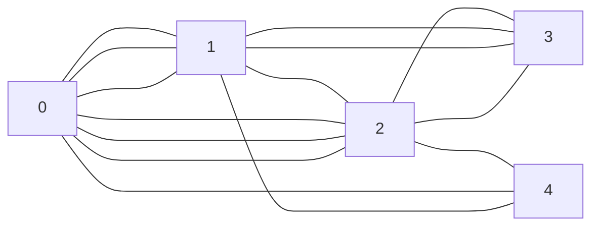

# shortest_path_faster
Finds the shortest path between two nodes in a graph using the shortest-path-faster algorithm

## Applied optimizations

- do not send messages when the distance is not infinity

### Possible further optimizations
- only send messages when the distance is smaller than the current distance


## Authors

- Elias Marcon MSc. | [@eliasmarcon](https://github.com/eliasmarcon)
- Ing. Fabian Steiner BSc.| [@fasteiner](https://github.com/fasteiner/)
- Jan Langela Regincos BSc. | [@janpilu](https://github.com/janpilu)

## Folder Structure

- `./include`:

  - `distributed_spf.h`: defines the data structure for the `distributed_spf.c` file

  - `Graph.h`: defines the data structure for the `Graph.c` file

- `./src`:

  - `distributed_spf.c`: initializes a distributed graph and performs a parallel implementation of the Shortest-Path-Faster Algorithm (SPFA) algorithm using MPI, where each process represents a node in the graph, and communication occurs between neighboring nodes to calculate the shortest path from a designated root node to all other nodes, with additional features such as timeout handling and message counting

  - `Graph.c`: defines functions to create and print a binary tree-based graph with a specified number of nodes, including memory allocation checks and edge generation based on the binary tree structure

- `./out`: contains the executable file `mpi_spf` for the shortest-path-faster search created through the build process

- `Makefile`: configuration file that controls the build process of the MPI program (contains rules and commands to compile the project and create the executable file `mpi_spf`)

- `start_shortest_path_faster.sh`: automates the execution of the `make all` command and MPI program (shortest-path-faster) with a user-specified number of processes and max depth (saves the results of the run in the output file `distributed_bfs_results.txt` for monitoring and analysis)

- `shortest_path_faster_result.txt`: contains the results of all runs with the latest run on top

## How to build

### Prerequisites

- Ubuntu 20.04
- mpich

### Build

- the `make all` command is included in the `start_shortest_path_faster.sh` file for the local run

### Usage

To use the provided Bash script for running the distributed breadth-first search algorithm, follow these steps:

1. Ensure that MPI is installed on your system.

2. Open a terminal and navigate to the directory containing this bash script.

3. Run the bash script by providing the run_type (cluster, local) and the number of MPI tasks as command-line arguments.

- Default Parameters:
  - run_type = local
  - number of tasks = 5

```sh
./start_distributed_bfs.sh <run_type> <number_of_tasks> (replace `<run_type>` and `<number_of_tasks>` with the actual values)

./start_distributed_bfs.sh local 8

./start_distributed_bfs.sh cluster 10 

```

## Example Graph with 5 Nodes/Processes

